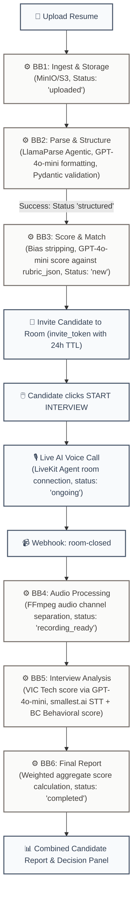
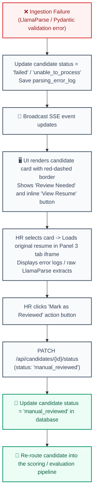
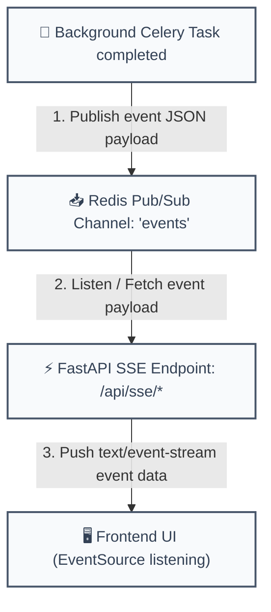

# TalentStream HR Platform: System Design Details

This document outlines structural blocks, layouts, and backend pipeline diagrams of the system.

---

## 0. High-Level Data Flow & System Block Diagram

```mermaid
flowchart LR
    %% Styling
    classDef stage fill:#eff6ff,stroke:#3b82f6,stroke-width:1.5px,color:#1d4ed8;
    classDef store fill:#ecfdf5,stroke:#10b981,stroke-width:1.5px,color:#047857;
    classDef proc fill:#ffedd5,stroke:#ea580c,stroke-width:1.5px,color:#c2410c;
    classDef ext fill:#f3e8ff,stroke:#7c3aed,stroke-width:1.5px,color:#6d28d9;

    subgraph ClientSpace ["User Layer"]
        UI["🖥️ Recruiter Web UI (SSE / REST)"]:::stage
        CandPortal["📱 Candidate Portal (WebRTC Audio)"]:::stage
    end

    subgraph CoreSpace ["Local Infrastructure Containers"]
        API["⚡ FastAPI Application Gateway<br/>(Middleware Router & Static Server)"]:::proc
        Postgres[("💾 PostgreSQL Database")]:::store
        Redis["📥 Redis Task Broker & Pub/Sub"]:::store
        AIWorker["🤖 Celery AI Worker"]:::proc
        AudioWorker["🎙️ Celery Audio Worker"]:::proc
    end

    subgraph ExternalSpace ["External Services Layer"]
        S3["📦 MinIO/S3 Cloud Storage"]:::ext
        LiveKit["📹 LiveKit Cloud WebRTC Server"]:::ext
        OpenAI["🧠 OpenAI GPT API (gpt-4o/gpt-4o-mini)"]:::ext
        Smallest["🗣️ smallest.ai STT API"]:::ext
        SendGrid["📧 SendGrid / SES Email API"]:::ext
        LlamaParse["📄 LlamaParse Cloud API"]:::ext
    end

    %% Flows
    UI -->|Upload Resume / CRUD Metadata| API
    CandPortal <-->|WebRTC Voice Exchange| LiveKit
    
    API -->|1. Save Files| S3
    API -->|2. Write Metadata| Postgres
    API -->|3. Enqueue Celery Job| Redis
    
    CandPortal -->|4. Start Interview (Token Validate)| API
    API -->|5. Request Rooms & Token| LiveKit
    API -->|6. Send Invitations| SendGrid
    
    Redis -->|Dispatch parsing/report| AIWorker
    Redis -->|Dispatch audio processing| AudioWorker
    
    AIWorker -->|2-A. Parse PDF (Agentic)| LlamaParse
    AIWorker -->|2-B. Format & Score| OpenAI
    AIWorker -->|2-C. Write Profile Details| Postgres
    
    LiveKit -->|7. Webhook: Room Closed| API
    AudioWorker -->|Fetch mixed call| S3
    AudioWorker -->|8. Split & Transcribe| Smallest
    AudioWorker -->|9. Score Behavioral| OpenAI
    AudioWorker -->|Save Scores & Transcripts| Postgres
    
    Postgres -->|Push Notification Events| Redis
    Redis -->|10. SSE Event Push| API
    API -.->|11. Live updates| UI
```

---

## 1. Three-Panel Frontend Layout (Desktop)
The web interface on desktop (resolutions >= 1024px) utilizes an Outlook-style three-panel layout structured as follows:

```
┌──────────────────────┬──────────────────────────────────────────┬─────────────────────────────────────┐
│ PANEL 1: SIDEBAR     │ PANEL 2: CANDIDATE LIST                  │ PANEL 3: CANDIDATE DETAIL PANEL     │
│ [ Logo: TalentStream]│ [ Job Title Header: Senior Python Dev ]  │ [ Header: Priya Sharma ]            │
│                      │ [ Count: 12 Candidates ]                 │ [ Shortlist ] [ Reject ] [ Invite ] │
│ [ ➕ Post Job ]       │                                          │                                     │
│                      │ [ Search Candidates... ]  [🔍]           │ +─────────────────────────────────+ │
│ JOB ROLES            │ [ Filter: All ] [ Sort: Score ] [📤 Upload]│ | Resume | Analysis | Interview     | │
│ ▼ Open               │                                          │ +─────────────────────────────────+ │
│   ├─ Python Dev      │ ┌──────────────────────────────────────┐ │ | [Professional Summary]          | │
│   ├─ Data Scientist  │ │ 👤 Rahul Dev               Score: 87%│ │ | Python dev with 5 years exp...  | │
│   └─ Devops Engineer │ │ Location: Austin, TX | Exp: 4 Yrs     │ |                                 | │
│ ▼ Closed             │ │ Status: 🟢 Ready   [Shortlist] [Reject]│ | [Resume Match Verification]     | │
│   └─ Product Designer│ └──────────────────────────────────────┘ │ | 🟢 Python (Expert)              | │
│                      │ ┌──────────────────────────────────────┐ │ | 🔴 Kubernetes (Missing)         | │
│                      │ │ 👤 Priya Sharma            Score: 92%│ |                                 | │
│                      │ │ Location: Remote | Exp: 8 Yrs        │ | [Recruiter's Perspective]       | │
│                      │ │ Status: 🔵 Parsed      [Invite] [Reject]│ | Candidates matches RVC check... | │
│                      │ └──────────────────────────────────────┘ │ |                                 | │
│                      │ ┌──────────────────────────────────────┐ │ | [Vocal Analysis Radar]          | │
│                      │ │ ⚠️ Unknown (Parse Failed)            │ | | (Confidence, Hesitation, WPM) | │
│                      │ │ Status: 🟠 Unable to Read            │ |                                 | │
│                      │ │ [Review] [Delete]                    │ | [Dialogue Transcript Player]    | │
│                      │ └──────────────────────────────────────┘ │ | 🎙️ Play Audio [.ogg]             | │
│                      │                                          │ | Candidate: "Yes, I have..."     | │
└──────────────────────┴──────────────────────────────────────────┴─────────────────────────────────────┘
```

### Layout Rules:
* **Panel 1 (Sidebar):** Contains the folder tree of jobs (Open vs. Closed), along with the job creation button.
* **Panel 2 (Middle Panel):** Displays the search input bar, filter pills, sorting options, and the drag-and-drop file upload button `[📤]`. Candidate list cards display overall scores and color-coded status badges corresponding to their pipeline state:
  * `uploaded`, `parsing`, `structured`, `scored`, `new`, `shortlisted`, `rejected`, `interview_invited`, `interview_scheduled`, `interview_ongoing`, `interview_completed`, `final_evaluation`, `hired`, `rejected_post_interview`, `failed`, `unable_to_process`, `manual_reviewed`
  * In case of parsing or validation failures, the status is set to `failed` or `unable_to_process`, applying red-dashed border layouts with "Review Needed" labels and inline "View Resume" actions.
* **Panel 3 (Details Panel):** Tabbed viewer loaded dynamically when a candidate card is selected. Contains tabs for Resume view, AI Match reports, Interview text transcript logs, Emotional/behavioral radar charts, and private HR notes.

---

## 2. Mobile Responsive Layout (Single Column)
On screens below 768px, the layout folds into a single-column stack:

```
[Candidate List Screen]                   [Selected Details Screen]
+-----------------------------------+     +-----------------------------------+
| (=) TalentStream             (📤) |     | (< Back) Priya Sharma         [SL]|
+-----------------------------------+     +-----------------------------------+
| Search candidates...         [🔍] |     | [ Resume ] [ Analysis ] [ Inter. ]|
+-----------------------------------+     +-----------------------------------+
| Rahul Dev                      87% |     |                                   |
| Location: Austin | Exp: 4 Yrs     |     | **Professional Summary**          |
| [🟢 Ready]                        |     | Python developer with over 5...   |
+-----------------------------------+     |                                   |
| Priya Sharma                  92% |     | **Vocal Behavior Scores**         |
| Location: Remote | Exp: 8 Yrs     |     | Confidence: 88%                   |
| [🔵 Parsed]                       |     | Hesitation: Low                   |
+-----------------------------------+     |                                   |
| Unknown (Parse Failed)            |     | **Vocal Transcript**              |
| [🟠 Unable to Read]               |     | Candidate: "I worked on..."       |
+-----------------------------------+     |                                   |
| (Jobs)    (Candidates)    (User)  |     |                                   |
+-----------------------------------+     +-----------------------------------+
```

### Mobile Layout Rules:
* **Sidebar Collapsed:** Left panel navigation is collapsed into the top-left hamburger menu `(=)`.
* **Detail Panel overlay:** Selecting a candidate card triggers a smooth slide-in overlay from the right edge. Clicking the `(< Back)` navigation button returns focus to the candidate list.
* **Bottom Navigation Bar:** Settings and core lists map to a bottom navigator with touch target elements measuring at least `48px`.

---

## 3. Backend Service Interaction Diagram

```mermaid
flowchart TD
    classDef app fill:#eff6ff,stroke:#3b82f6,stroke-width:2px,color:#1d4ed8;
    classDef broker fill:#fee2e2,stroke:#ef4444,stroke-width:2px,color:#b91c1c;
    classDef worker fill:#ffedd5,stroke:#f97316,stroke-width:2px,color:#c2410c;
    classDef storage fill:#dcfce7,stroke:#22c55e,stroke-width:2px,color:#15803d;

    API["⚡ FastAPI Application (Middleware)"]:::app
    Redis["📥 Redis Broker / Pub-Sub"]:::broker
    Workers["🧠 Celery Workers (AI & Audio)"]:::worker
    Postgres[("💾 PostgreSQL Database")]:::storage
    S3[("📦 S3 Cloud Object Storage")]:::storage

    API -->|1. Create Footprint / Fetch Metadata| Postgres
    API -->|2. Upload File / Get Presigned URL| S3
    API -->|3. Dispatch Job (ID payload)| Redis
    Redis -->|4. Pull Task| Workers
    Workers -->|5. Read Resume / Audio file| S3
    Workers -->|6. Write scoring / transcript results| Postgres
    Workers -->|7. Publish complete event| Redis
    Redis -->|8. SSE Server Push| API
```

---

## 4. End-to-End Data Pipeline Flow



---

## 5. Ingestion Error & Manual Review Flow



---

## 6. Real-Time Update Pipeline


