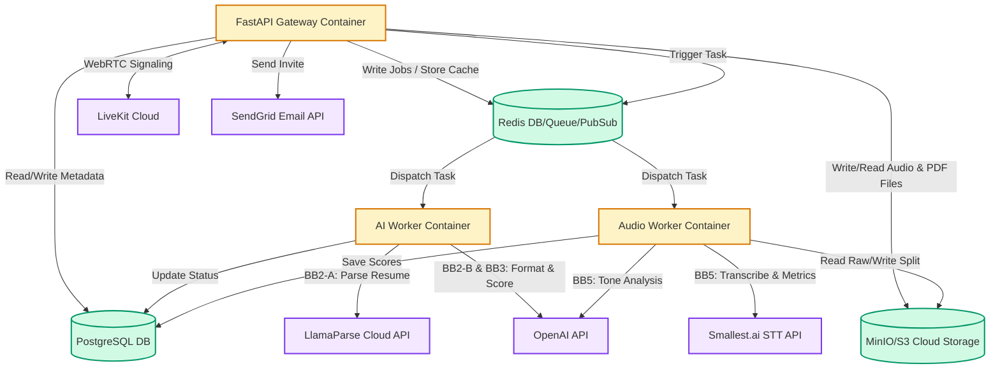
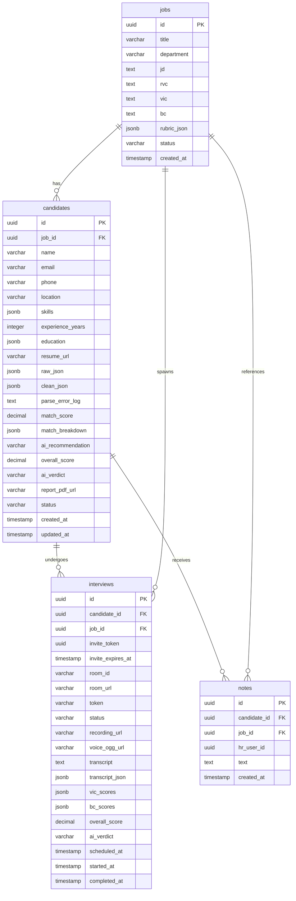
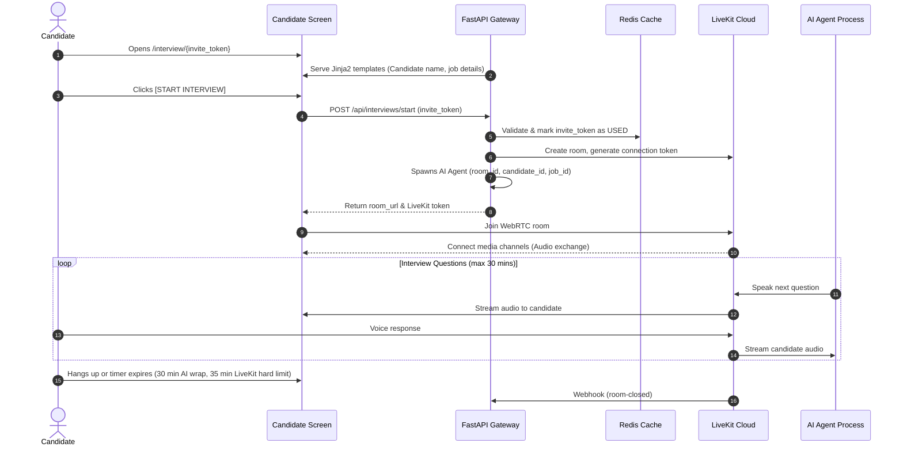
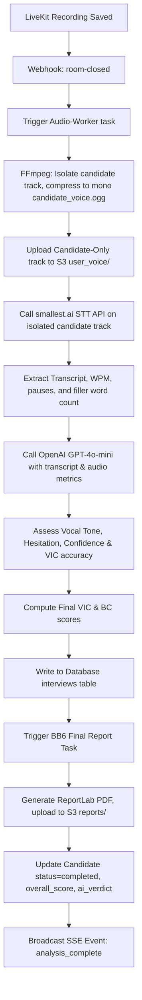
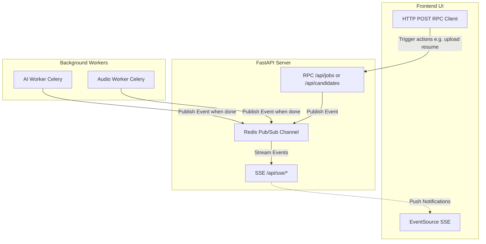
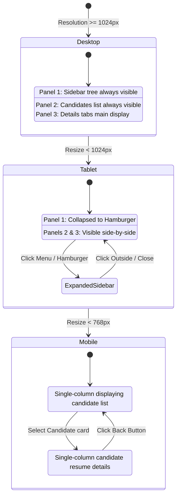

# TalentStream HR Platform: Mermaid Diagrams

This document contains Mermaid diagrams visualizing the architecture, database schema, pipelines, and state transitions of the TalentStream HR Platform.

---

## 1. System Architecture Diagram



---

## 2. Database Entity-Relationship Diagram



---

## 3. Resume Ingestion & Parsing Flow

```mermaid
flowchart TD
    A[HR Drops Resume File] --> B[POST /api/candidates/upload]
    B --> C[Save File to S3 Bucket resumes/]
    C --> D[Create Candidate Row status=uploaded]
    D --> E[Enqueue Celery Job]
    E --> F[Worker: BB2-A LlamaParse Agentic parsing]
    F --> G{Success?}
    G -->|Yes| H[BB2-B GPT-4o-mini JSON Formatter & BB2-C Pydantic check]
    H -->|Success: status=structured| I[BB3 Score & Match: bias stripping + rubric_json scoring]
    I --> J[Update Candidate match_score, status=new]
    J --> K[Broadcast SSE Event: candidate_ready]
    G -->|No| L[Set status=failed, save parse_error_log]
    H -->|Fail 3 times| M[Set status=unable_to_process, save parse_error_log]
    L --> N[Broadcast SSE Event: parse_failed]
    M --> N
    N --> O[HR selects card & reviews original resume PDF in iframe]
    O --> P[HR clicks Mark as Reviewed in detail footer]
    P --> Q[PATCH /api/candidates/{id}/status status=manual_reviewed]
    Q --> R[Update Candidate status=manual_reviewed & re-route into pipeline]
```

---

## 4. Live AI Interview Flow



---

## 5. Audio Processing & Behavioral Analysis Pipeline



---

## 6. Real-Time Communication Strategy (SSE vs WebSockets vs Webhook)



---

## 7. Responsive Layout State Diagram


