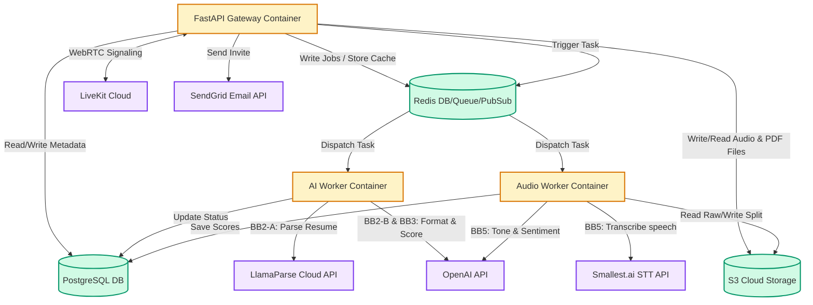

# TalentStream HR Platform: Comprehensive End-To-End Architecture Specification v1.0

This document provides a detailed, production-ready system architecture specification for the TalentStream HR Platform. It consolidates all system workflows, data schemas, API gateways, user interface structures, real-time strategies, and operational controls into a single, copy-pasteable blueprint.

---

## 1. System Overview & Scale
TalentStream is an AI-powered automated hiring and candidate screening platform built to manage recruitment pipelines efficiently for small teams. The platform automates resume ingestion, semantic profile matching, live WebRTC voice interviews, speech and tone analysis, and final consolidated evaluations.

* **Target Processing Scale:** 250–300 resumes ingested/processed per day.
* **Recruiter Concurrency:** 1–2 active HR managers.
* **Operating Model:** Fully automated black box pipeline with human-in-the-loop validation for processing failures.

---

## 2. Core Job Criteria Matrix (The Four Criteria)
Every job post created in the system contains a set of criteria fields that remain frozen throughout the candidate lifecycle to ensure evaluation integrity:

| Criteria | Code | What It Defines | When It Is Used |
| :--- | :--- | :--- | :--- |
| **Job Description** | **JD** | The actual job posting text, core responsibilities, and qualifications | Resume matching, interview question contextualization |
| **Resume Verification Criteria** | **RVC** | Hard filters, technical requirements, and rules for scoring resumes | Converted to rubric_json on job creation |
| **Voice Interview Criteria** | **VIC** | Technical parameters, key concepts, and grading guidelines for the interview | Post-interview technical transcript scoring |
| **Behavioral Criteria** | **BC** | Voice, acoustic, and behavioral target parameters (e.g., confidence, speech rate) | Post-interview behavioral scoring of the `.ogg` voice recording |

---

## 3. Frontend Layout & UI Architecture
The user interface is designed with a premium, responsive glassmorphic design system using Outfit/Inter typography, smooth gradients, and custom SVG iconography. 

### 3.1 Desktop Layout (Resolutions >= 1024px)
The desktop view implements a 3-panel Outlook-Style Grid:
```
┌──────────────────────┬──────────────────────────────────────────┬─────────────────────────────────────┐
│ PANEL 1: SIDEBAR     │ PANEL 2: CANDIDATE LIST                  │ PANEL 3: CANDIDATE DETAIL PANEL     │
│ [ Logo: TalentStream]│ [ Job Title Header: Senior Python Dev ]  │ [ Header: Priya Sharma ]            │
│                      │ [ Count: 12 Candidates ]                 │ [ Shortlist ] [ Reject ] [ Invite ] │
│ [ ➕ Post Job ]       │                                          │                                     │
│                      │ [ Search Candidates... ]  [🔍]           │ +─────────────────────────────────+ │
│ JOB ROLES            │ [ Filter: All ] [ Sort: Score ] [📤 Upload]│ | Resume | Analysis | Interview     | │
│ ▼ Open               │                                          │ +─────────────────────────────────+ │
│   ├─ Python Dev      │ ┌──────────────────────────────────────┐ │ | [Professional Summary]          | │
│   ├─ Data Scientist  │ │ 👤 Rahul Dev               Score: 87%│ │ | Python dev with 5 years exp...  | │
│   └─ Devops Engineer │ │ Location: Austin, TX | Exp: 4 Yrs     │ |                                 | │
│ ▼ Closed             │ │ Status: 🟢 Ready   [Shortlist] [Reject]│ | [Resume Match Verification]     | │
│   └─ Product Designer│ └──────────────────────────────────────┘ │ | 🟢 Python (Expert)              | │
│                      │ ┌──────────────────────────────────────┐ │ | 🔴 Kubernetes (Missing)         | │
│                      │ │ 👤 Priya Sharma            Score: 92%│ |                                 | │
│                      │ │ Location: Remote | Exp: 8 Yrs        │ | [Recruiter's Perspective]       | │
│                      │ │ Status: 🔵 Parsed      [Invite] [Reject]│ | Candidates matches RVC check... | │
│                      │ └──────────────────────────────────────┘ │ |                                 | │
│                      │ ┌──────────────────────────────────────┐ │ | [Vocal Analysis Radar]          | │
│                      │ │ ⚠️ Unknown (Parse Failed)            │ | | (Confidence, Hesitation, WPM) | │
│                      │ │ Status: 🟠 Unable to Read            │ |                                 | │
│                      │ │ [Review] [Delete]                    │ | [Dialogue Transcript Player]    | │
│                      │ └──────────────────────────────────────┘ │ | 🎙️ Play Audio [.ogg]             | │
│                      │                                          │ | Candidate: "Yes, I have..."     | │
└──────────────────────┴──────────────────────────────────────────┴─────────────────────────────────────┘
```
* **Panel 1 (Sidebar - 20% Width):** Contains the folder tree of jobs (Open vs. Closed), along with the job creation button.
* **Panel 2 (Middle Panel - 50% Width):** Displays search input, filter pills, sorting options, and the drag-and-drop file upload zone. Candidate list cards display overall scores, status badges, and quick-action triggers (Shortlist, Reject, Invite).
* **Panel 3 (Details Panel - 30% Width):** Tabbed viewer loaded dynamically when a candidate card is selected. Contains tabs for Resume view, AI Match reports (showing `match_breakdown`), Interview text transcript logs, Emotional/behavioral radar charts, and private HR notes.

### 3.2 Mobile Layout (Resolutions < 768px)
* **Single Column Container Stack:** The three panels fold into a single column.
* **Hamburger Menu `(=)`:** Accesses the collapsed Left Panel (Sidebar).
* **Slide-In Overlay Drawer:** Displays Right Panel (Details view) upon selecting a candidate, with a prominent back button.
* **Persistent Bottom Nav:** Features touch target elements measuring at least `48px`.

### 3.3 Candidate Status Badge States
Candidates follow a strict state transition model:
`uploaded`, `parsing`, `structured`, `scored`, `new`, `shortlisted`, `rejected`, `interview_invited`, `interview_scheduled`, `interview_ongoing`, `interview_completed`, `final_evaluation`, `hired`, `rejected_post_interview`, `failed`, `unable_to_process`, `manual_reviewed`.
* **failed**: LlamaParse cannot read the file (PDF corrupted, password-protected, encrypted, unsupported format, S3 upload failed, LlamaParse API error).
* **unable_to_process**: LlamaParse succeeded, but GPT parsing / Pydantic validation failed 3 times.
* **manual_reviewed**: A failed or unable_to_process candidate that has been manually inspected and marked as reviewed by the recruiter, allowing re-entry into the scoring pipeline.

---

## 4. Platform Infrastructure & Component Architecture



### 4.1 Local Containers (Your Infrastructure)
1. **api (FastAPI, Port 8000):** Serves static frontend assets, runs the API endpoints, manages SSE streams, and handles webhooks.
2. **ai-worker (Celery):** Celery worker handling resume parsing (BB2-A, BB2-B, BB2-C), AI match scoring (BB3), and weighted report generation (BB6).
3. **audio-worker (Celery):** Celery worker handling FFmpeg audio channel separation (BB4) and behavioral transcript/pacing analysis (BB5).
4. **db (PostgreSQL, Port 5432):** Primary relational database storage.
5. **redis (Port 6379):** Message broker for Celery queues and Pub/Sub channel manager for FastAPI Server-Sent Events (SSE).

### 4.2 External Services (Provided Infrastructure - Do NOT Build Local Equivalents)
* **LiveKit Cloud:** Video/audio WebRTC interview rooms.
* **MinIO/S3 Cloud:** S3-compatible cloud storage for PDF resumes and audio. Connected via `boto3`.
* **OpenAI GPT API:** OpenAI engine (`gpt-4o` for voice agent, `gpt-4o-mini` for parsing/scoring) used for parsing, match checking, prompt structuring, and tone scoring.
* **smallest.ai STT API:** Acoustic processing and transcription service. Retrieves speech rates, filler word counts, and hesitation timestamps.
* **SendGrid / AWS SES:** Email service for distributing interview invitations.
* **LlamaParse Cloud API:** Document parsing in agentic mode.

### 4.3 Excluded Components
* **❌ No Nginx:** Nginx is not deployed. Local development runs on Uvicorn directly. Production runs with Caddy proxying port 8000.
* **❌ No Local LiveKit Server:** The system relies entirely on the cloud-hosted LiveKit endpoint.
* **❌ No Local MinIO Server:** Local containerized MinIO is excluded; the system connects to the provided cloud S3 endpoint.
* **❌ No Separate Report Worker:** Reporting and scoring are lightweight and are merged directly into the AI Worker.

### 4.4 Production Caddyfile Configuration
```caddy
yourdomain.com {
    reverse_proxy localhost:8000
}
```

---

## 5. The 6-Stage Black Box Pipeline & Middleware Router
The application uses a **Middleware Router** pattern implemented inside FastAPI. The Middleware receives incoming requests, coordinates background queues via Celery, and dispatches data to six distinct Black Boxes:

### Black Box 1: Ingest & Storage
* **Input:** Candidate resume file upload (PDF/DOCX/TXT) via `POST /api/candidates/upload`.
* **Output:** Database entry with S3 storage key footprint.
* **Flow:** Receives multipart upload stream -> Validates file size is < 10MB -> Saves file to S3 bucket (`resumes/{job_id}/{candidate_id}/resume.pdf`) -> Inserts DB candidate row (`status = "uploaded"`, `resume_url = S3 Path`). Enqueues Celery task for BB2 and broadcasts `upload_progress` SSE event.

### Black Box 2: Parse & Structure (ai-worker)
* **BB2-A (LlamaParse Agentic):** Downloads resume and calls LlamaParse Cloud API in agentic mode. If it fails, retries once in cost-effective mode. On persistent failure, sets candidate `status="unable_to_process"` and populates `parse_error_log`.
* **BB2-B (GPT-4o-mini Formatter):** Sends LlamaParse Markdown to GPT-4o-mini with temperature=0, seed=42, and `response_format={"type":"json_object"}` to extract structured fields (`name`, `email`, `phone`, `location`, `skills[]`, `experience_years`, `education[{degree, institution}]`).
* **BB2-C (Pydantic Validator):** Enforces schema using CandidateSchema. Executes up to 3 progressive attempts on validation failures:
  * Attempt 1: Base prompt, temperature=0.
  * Attempt 2: Base prompt + explicit examples, temperature=0.
  * Attempt 3: Stricter prompt + examples, temperature=0.
  If all attempts fail, transitions candidate `status="unable_to_process"` and sends an SSE alert. On success, transitions candidate `status="structured"` and populates `clean_json`.

### Black Box 3: Score & Match (ai-worker)
* **Step 1: Bias Strip:** Removes `name`, `email`, `phone`, `location`, graduation year, and university names. Replaces them with `anon_id`, `years_since_degree`, and `degree_level`.
* **Step 2: Score:** Sends bias-stripped profile and `jobs.rubric_json` to GPT-4o-mini (temperature=0, seed=42, structured output) to obtain sub-scores (skills max 40, experience max 30, education max 20, certs max 10), `total_score`, `recommendation`, and `rationale`.
* **Step 3: Validate:** Checks that `total_score` is an integer between 0 and 100, and `recommendation` is one of `strong_hire`, `hire`, `hold`, `manual_review`, or `reject`. If validation fails, retries once, then flags candidate status as `manual_review`.
* **Step 4: Store:** Updates candidate table with `match_score`, `match_breakdown`, and `ai_recommendation`, sets status to `new`, and broadcasts the `candidate_ready` SSE event.

### Black Box 4: Audio Processing (audio-worker)
* **Input:** Mixed MP4 recording URL from LiveKit, triggered by webhook `POST /api/webhooks/livekit/room-closed`.
* **Output:** Isolated candidate voice audio track compressed as `.ogg` at `s3://user_voice/{interviewId}/candidate_voice.ogg`.
* **Flow:** Downloads mixed MP4 -> Uses FFmpeg to separate channels:
  ```bash
  ffmpeg -i mixed_input.mp4 \
    -filter_complex '[0:a]channelsplit=channel_layout=stereo[left][right]' \
    -map '[right]' -ac 1 -c:a libopus -b:a 32k candidate_voice.ogg
  ```
  * **Explanation:** `-map_channel` is deprecated and unreliable. `-filter_complex channelsplit` properly separates stereo channels. The `[right]` channel represents candidate voice (AI is on left channel in LiveKit mixed recording). `-ac 1` outputs mono, `-c:a libopus` uses the Opus codec, and `-b:a 32k` sets the bitrate to 32kbps.
  * **Validation:** After FFmpeg, checks output file duration matches input (±1 second). If mismatch: retries once, then flags as `audio_processing_failed`.
  * **Upload:** Uploads candidate track to S3 under `user_voice/{interview_id}/candidate_voice.ogg`. Saves S3 path to DB and sets interview status to `recording_ready`.

### Black Box 5: Interview Analysis (audio-worker)
* **Input:** Interview transcript + Candidate `.ogg` audio track + Job's VIC & BC criteria.
* **Output:** Technical score (VIC) + Behavioral/acoustic score (BC).
* **Flow:**
  * **Branch A (VIC):** Transcript text is graded against VIC criteria using GPT-4o-mini, outputting a technical score saved to `vic_scores`.
  * **Branch B (BC):** Candidate `.ogg` file is processed via smallest.ai STT to compute speech rate (WPM), filler count, and pauses. GPT-4o-mini tone analysis grades behavioral parameters against Job's BC criteria. Saves results to `bc_scores`.

### Black Box 6: Final Report (ai-worker)
* **Input:** Resume match score + VIC overall score + BC overall score.
* **Output:** Weighted overall score, AI verdict, and human-readable summary.
* **Flow:**
  * **Weighting:** `overall_score = (match_score * 0.40) + (vic_score * 0.35) + (bc_score * 0.25)`.
  * **AI Verdict:** Maps overall score to recommendation categories (`Strong Hire` (90-100), `Hire` (75-89), `Hold` (60-74), `Needs Review` (45-59), `Reject` (0-44)).
  * **Report Generation:** Generates a PDF report using ReportLab, uploads it to S3 under `reports/{candidate_id}.pdf`, updates the candidate record (`overall_score`, `ai_verdict`, `report_pdf_url`, `status="completed"`), and broadcasts `analysis_complete` SSE event to recruiter UI.

---

## 6. Database Schema & ER Diagram

### PostgreSQL Table Definitions
```sql
CREATE EXTENSION IF NOT EXISTS "uuid-ossp";

-- 1. Jobs Table
CREATE TABLE jobs (
    id UUID PRIMARY KEY DEFAULT uuid_generate_v4(),
    title VARCHAR(255) NOT NULL,
    department VARCHAR(100) NOT NULL,
    jd TEXT NOT NULL,
    rvc TEXT NOT NULL,
    vic TEXT NOT NULL,
    bc TEXT NOT NULL,
    rubric_json JSONB,
    status VARCHAR(20) NOT NULL DEFAULT 'open', -- 'open', 'closed'
    created_at TIMESTAMP WITH TIME ZONE DEFAULT CURRENT_TIMESTAMP
);

-- 2. Candidates Table
CREATE TABLE candidates (
    id UUID PRIMARY KEY DEFAULT uuid_generate_v4(),
    job_id UUID REFERENCES jobs(id) ON DELETE CASCADE,
    name VARCHAR(255) DEFAULT 'Unknown (Parse Failed)',
    email VARCHAR(255),
    phone VARCHAR(20),
    location VARCHAR(100),
    skills JSONB,
    experience_years INTEGER,
    education JSONB,
    resume_url VARCHAR(500),
    raw_json JSONB,
    clean_json JSONB,
    parse_error_log TEXT,
    match_score DECIMAL(5, 2),
    match_breakdown JSONB,
    ai_recommendation VARCHAR(50),
    overall_score DECIMAL(5, 2),
    ai_verdict VARCHAR(50),
    report_pdf_url VARCHAR(500),
    status VARCHAR(50) NOT NULL DEFAULT 'uploaded',
    latest_interview_id UUID, -- FK to interviews.id ON DELETE SET NULL (circular reference, added below)
    latest_invite_token UUID, -- stores most recent invite for quick HR view
    created_at TIMESTAMP WITH TIME ZONE DEFAULT CURRENT_TIMESTAMP,
    updated_at TIMESTAMP WITH TIME ZONE DEFAULT CURRENT_TIMESTAMP
);

-- 3. Interviews Table
CREATE TABLE interviews (
    id UUID PRIMARY KEY DEFAULT uuid_generate_v4(),
    candidate_id UUID REFERENCES candidates(id) ON DELETE CASCADE,
    job_id UUID REFERENCES jobs(id) ON DELETE CASCADE,
    invite_token UUID UNIQUE,
    invite_expires_at TIMESTAMP WITH TIME ZONE,
    room_id VARCHAR(100),
    room_url VARCHAR(500),
    token VARCHAR(500),
    status VARCHAR(50) NOT NULL DEFAULT 'scheduled', -- 'scheduled', 'ongoing', 'reconnecting', 'completed', 'cancelled', 'failed'
    recording_url VARCHAR(500),
    voice_ogg_url VARCHAR(500),
    transcript TEXT,
    transcript_json JSONB,
    vic_scores JSONB,
    bc_scores JSONB,
    overall_score DECIMAL(5, 2),
    ai_verdict VARCHAR(50),
    scheduled_at TIMESTAMP WITH TIME ZONE,
    started_at TIMESTAMP WITH TIME ZONE,
    completed_at TIMESTAMP WITH TIME ZONE
);

-- 4. Notes Table
CREATE TABLE notes (
    id UUID PRIMARY KEY DEFAULT uuid_generate_v4(),
    candidate_id UUID REFERENCES candidates(id) ON DELETE CASCADE,
    job_id UUID REFERENCES jobs(id) ON DELETE CASCADE,
    hr_user_id UUID,
    text TEXT NOT NULL,
    created_at TIMESTAMP WITH TIME ZONE DEFAULT CURRENT_TIMESTAMP
);

-- 5. Foreign Key for Circular Reference on Candidates
ALTER TABLE candidates ADD CONSTRAINT fk_latest_interview FOREIGN KEY (latest_interview_id) REFERENCES interviews(id) ON DELETE SET NULL;
```

---

## 7. API Gateway Endpoints

### 7.1 Job Management (`/api/jobs`)
* `POST /api/jobs` - Create a job listing with frozen criteria (JD, RVC, VIC, BC). RVC text is parsed -> `rubric_json` via GPT-4o-mini.
* `GET /api/jobs?status=open|closed` - List jobs filtered by state.
* `GET /api/jobs/{id}` - Fetch details of a single job.
* `PATCH /api/jobs/{id}/close` - Close job listing.
* `PATCH /api/jobs/{id}/reopen` - Reopen job listing.
* `DELETE /api/jobs/{id}` - Delete job listing.

### 7.2 Candidate Management (`/api/candidates`)
* `POST /api/candidates/upload` - Upload resume file, returns `uploadId` and starts BB1.
* `GET /api/candidates?jobId={id}&status={filter}&sort={field}` - List candidate cards with filters and sorting. Returns `latest_interview_id` and `latest_invite_token` for each candidate card (no JOIN needed).
* `GET /api/candidates/{id}` - Get candidate profile and analysis reports.
* `PATCH /api/candidates/{id}/status` - Modify candidate status (supports transitions to manual_reviewed).
* `POST /api/candidates/{id}/notes` - Add recruiter private comment.
* `GET /api/candidates/{id}/reports` - Fetch consolidated evaluation report (presigned S3 URL).
* `GET /api/candidates/{id}/resume-url` - Generate S3 presigned URL for candidate's resume (available for all states).

### 7.3 Interview Actions & Flow (`/api/interviews`)
* `POST /api/interviews/{candidate_id}/invite` - Generates `invite_token` UUID, stores in Redis with 24h TTL, triggers SendGrid invitation containing tracking link `/interview/{invite_token}`, updates candidate status to `interview_invited`. After creating interview, `UPDATE candidates SET latest_interview_id = new_interview_id, latest_invite_token = new_invite_token`.
* `GET /interview/{invite_token}` - Validates invite token in Redis. Fetches candidate name, job title, company, JD, and VIC details. Serves dynamic `interview_landing.html` template.
* `POST /api/interviews/start` - Validates invite token. Creates LiveKit room on the fly (max 35 min, recording enabled). Generates candidate JWT token. Spawns Celery `spawn_agent` task. Inserts interview record, marks invite token as USED, and returns room details.

  **Duplicate Prevention Layers:**
  * **Layer 1 — Redis Atomic Token Lock:**
    * POST `/api/interviews/start` uses Redis `SET invite:{token} "used" NX EX 2100`.
    * NX = only set if not exists (atomic, prevents race conditions).
    * If SET returns False (already used): return `409 Conflict`.
    * This prevents two devices from both passing validation in the same millisecond.
  * **Layer 2 — Interview Status Check:**
    * Before creating room, check `interviews.status != "ongoing"`.
    * If status is already "ongoing": return `409 Conflict` (interview already active).
  * **Layer 3 — LiveKit Room Participant Cap:**
    * Room created with `maxParticipants = 2` (agent + candidate only).
    * If somehow bypassed Layer 1+2, LiveKit rejects third connection.
* `POST /api/interviews/{id}/end` - Command LiveKit Cloud to close the room.
* `GET /api/interviews/{id}/transcript` - Fetch transcript details.
* `GET /api/interviews/{id}/audio` - presigned S3 URL for candidate voice.

### 7.4 Real-Time SSE Streams (`/api/sse`)
* `GET /api/sse/uploads/{uploadId}` - Stream parsing and matching state to UI.
* `GET /api/sse/jobs/{jobId}/candidates` - Stream candidate card list state transitions.
* `GET /api/sse/analysis/{interviewId}` - Stream audio splitting and analysis completion updates.

### 7.5 Third-Party Webhook Receivers (`/api/webhooks`)
* `POST /api/webhooks/livekit/room-closed` - LiveKit session ends and recording is ready. FastAPI validates JWT signature and triggers BB4.
* `POST /api/webhooks/email/delivered` - SendGrid delivery status callback.
* `POST /api/webhooks/email/bounced` - SendGrid bounce status callback.

### 7.6 Rate Limiting Rules
Public endpoints (no auth required):
* `GET /interview/{invite_token}`: 10 requests per IP per minute
* `POST /api/interviews/start`: 5 requests per IP per minute
* `POST /api/candidates/upload`: 50 requests per IP per day (matches `DAILY_RESUME_LIMIT`)

Authenticated endpoints:
* `POST /api/jobs`: 20 per minute per user
* `POST /api/interviews/{candidate_id}/invite`: 10 per minute per user
* `GET /api/sse/*`: 5 concurrent connections per user

Implementation:
* Use `slowapi` (FastAPI rate limiter) with Redis backend.
* Key format: `ratelimit:{endpoint}:{client_ip}`.
* On exceed: return `429 Too Many Requests` with `Retry-After` header.
* Exempt: webhooks (`/api/webhooks/*`) — they use JWT signature validation instead.

---

## 8. Real-Time Communication Strategy
To maximize performance and keep the UI reactive, communication modes are strictly partitioned:

* **Server-Sent Events (SSE):** Used for one-way streaming updates from backend to recruiter dashboard (parsing state, real-time matching status).
* **WebSocket/WebRTC:** Used for interactive, low-latency WebRTC room signaling and active conversational control.
* **Webhooks:** Used for asynchronous third-party callbacks (LiveKit recording completion, email receipt).
* **Celery Safety Daemon:** A worker task runs every 30 minutes to clean up stale interviews and force-analyze partial recordings.

---

## 9. Interview Session Lifecycle & Graceful Ending Flow
The AI voice agent conducts the interview inside the LiveKit room, tracking elapsed time:
* **0-25 mins:** Conducting normal question flow based on resume and job VIC guidelines.
* **25 mins:** Agent states: *"We have about 5 minutes remaining. Let's wrap up with our final areas."*
* **28 mins:** Agent states: *"One final question for you before we conclude."* (quick-response question)
* **30 mins:** Agent says: *"Thank you. That concludes our interview today. Goodbye."*, submits `POST /api/interviews/{id}/end` to the gateway, and disconnects.

### Safety Nets
* **LiveKit Room Expiry:** Hard-limited to 35 minutes (LiveKit cloud force-closes).
* **Celery Safety Daemon:** Runs every 30 minutes, auditing ongoing interviews active > 40 minutes. Calls LiveKit API to close the room, downloads partial audio, and triggers BB4.

### Agent Memory Architecture
* The LiveKit AI agent (`livekit_agent.py`) is a Python script connecting to LiveKit Cloud.
* When Celery dispatches the agent task, it passes ONLY: `candidate_id`, `job_id`, `room_id`.
* The agent queries PostgreSQL DIRECTLY at startup (before joining room):
  * `SELECT clean_json FROM candidates WHERE id = :candidate_id`
  * `SELECT jd, vic, bc FROM jobs WHERE id = :job_id`
* The agent builds its `system_prompt` from DB data in memory.
* Heavy data (resume JSON, job criteria) NEVER travels over HTTP or Redis.
* Only 36-character UUIDs pass between API → Celery → Agent.
* The agent connects to PostgreSQL using the same `DATABASE_URL` as the API.

### Reconnection Flow & State Transitions
* **ongoing → reconnecting:** LiveKit fires `participant_disconnected` event. This updates `interviews.status` to `reconnecting`.
* **reconnecting → ongoing:** Candidate rejoins within 10 min.
* **reconnecting → failed:** 10 min passes, room expires, candidate never rejoined, or safety net closed.
* **reconnecting → completed:** Agent ends interview before reconnect (rare).

**Agent behavior on reconnect/disconnect:**
* When status = "reconnecting", agent pauses question timer.
* Agent monitors room for `participant_connected` event.
* If reconnect: resume from last question.
  * If disconnect < 30 seconds: continue seamlessly, no acknowledgment.
  * If disconnect > 30 seconds: *"Welcome back. Let's continue — you were explaining..."*
* If 10-minute grace window timeout: agent exits, status → `failed`.
* Agent retains full `conversation_history` in process memory.

### Redis Room Tracking
* When `POST /api/interviews/start` creates room:
  ```
  SET room:{room_id}:created_at {timestamp} EX 2100  # 35 min TTL
  SET room:{room_id}:candidate_id {candidate_id} EX 2100
  SET room:{room_id}:interview_id {interview_id} EX 2100
  ```
* When candidate disconnects:
  ```
  SET room:{room_id}:disconnect_time {timestamp} EX 600  # 10 min grace
  ```
* On reconnect attempt:
  1. Check Redis `GET room:{room_id}:created_at` (1ms, no LiveKit API call).
  2. If exists and not expired: allow reconnect to SAME room.
  3. If missing or expired: call LiveKit API to verify, then decide.
* On room close (webhook or agent end):
  ```
  DEL room:{room_id}:created_at room:{room_id}:disconnect_time room:{room_id}:candidate_id room:{room_id}:interview_id
  ```

---

## 10. Cost Controls & Performance Monitoring
* **Cost Controls:**
  * OpenAI Monthly Budget alert configured at $50/month.
  * `gpt-4o-mini` is used for high-volume parsing and matching.
  * `gpt-4o` is used for dynamic weight setting (seed=42) and live voice agent processing.
  * Resume upload limit of 50 resumes/day per HR manager.
  * Relies entirely on the provided external S3/MinIO cloud endpoints to eliminate local storage fees.
* **Monitoring:**
  * Free-tier Sentry integration on FastAPI and Celery workers for error logging.
  * Free-tier UptimeRobot monitoring active endpoints.
  * Celery worker emails administrators on uncaught worker crashes.

---

## 11. Anti-Cheat Detection
The system implements a multi-layered integrity verification model:

* **Layer 1 — Tab Close Detection:**
  * Browser fires `beforeunload` event → logs `tab_intentionally_closed` with timestamp.
  * LiveKit reports disconnect reason: `CLIENT_INITIATED` vs `NETWORK_ERROR`.
  * Both stored in `interview_events` table.
* **Layer 2 — Offline Duration Flagging:**
  * On reconnect, calculate: `offline_duration = reconnect_time - disconnect_time`.
  * If `disconnect_reason = CLIENT_INITIATED` AND `offline_duration > 90 seconds`:
    * Flag as `SUSPICIOUS_RECONNECT` in `interview_events`.
    * Store: `{offline_ms, disconnect_reason, question_at_disconnect}`.
* **Layer 3 — Agent Follow-Up Pivot:**
  * On reconnect after suspicious disconnect (>90s, `CLIENT_INITIATED`):
    * Agent does NOT repeat the last question.
    * Instead asks unpredictable follow-up based on candidate's previous answer.
    * Example: *"Before we continue, you mentioned X. How would you handle that under 10x load?"*
    * This cannot be pre-Googled because it depends on their own prior response.
* **Layer 4 — Tab Visibility API:**
  * Browser `visibilitychange` event detects tab switching mid-interview.
  * Logs: `focus_lost` (timestamp), `focus_restored` (timestamp), duration.
  * Stored in `interview_events` table.
  * Appears in recruiter's final report as *"Tab focus lost N times, avg X seconds"*.
* **Layer 5 — Speech Pattern Analysis:**
  * `smallest.ai` STT provides: WPM, `filler_word_count`, `hesitation_timestamps`.
  * Post-interview, GPT-4o-mini behavioral analysis flags anomalies:
    * Unnaturally consistent pace (recited answer vs thinking).
    * Zero hesitation after long offline period.
    * Absence of filler words ("um", "uh") vs baseline.
  * Flag stored in `bc_scores.integrity_flag`: true/false.
  * Rationale stored in `bc_scores.integrity_rationale`: "string".

### Recruiter Report Integrity Section
* Panel 3 → Interview tab → "Interview Integrity Events" subsection.
* Displays timeline: disconnects, tab switches, offline durations, speech anomalies.
* Does NOT affect `overall_score` — purely informational for HR review.
* HR can click `[Flag for Review]` if integrity events are concerning.

---

## 12. Data Flow Security Architecture
* Heavy data (such as parsed resume JSON, job criteria, and raw text transcripts) NEVER travels over the HTTP/Redis wire between services.
* Only lightweight 36-character UUIDs (`candidate_id`, `job_id`, `interview_id`, `room_id`) are permitted to pass over the wire between the API gateway, Celery broker, and background workers/agents.
* Background Celery workers and LiveKit agents must read heavy payload files (resumes, audio recordings) directly from S3/MinIO and query PostgreSQL metadata tables directly using the `candidate_id`/`job_id`/`interview_id` as lookup keys.
* This ensures minimal memory footprint on the queue broker, eliminates HTTP transit overhead, and secures sensitive candidate details within Postgres/S3 boundaries.

---

## 13. Agent Process Lifecycle

The LiveKit agent (`livekit_agent.py`) follows a strictly managed execution lifecycle to handle session setups, active dialog, unexpected disconnects, and clean exits:

### 13.1 START Phase
* **Celery Dispatch:** The worker receives a `spawn_agent` task with only: `candidate_id`, `job_id`, and `room_id`.
* **Database Connection:** The agent process starts and establishes a direct connection to the PostgreSQL database.
* **Context Fetching:** It queries PostgreSQL directly using SQL parameter binding to fetch the candidate's structured profile (`clean_json`) and the job description details (`jd`, `vic`, `bc`).
* **Prompt Assembly:** In-memory, the agent constructs the personalized `system_prompt` outlining criteria directives.
* **Join Attempt:** The agent connects to the LiveKit room using `ctx.connect()`.
* **Initial State:** The agent status is set to `WAITING` (room is empty, awaiting candidate connection).

### 13.2 RUN Phase
* **Candidate Join Event:** Once the candidate joins the WebRTC room, the agent transitions status to `INTERVIEWING` and starts the conversational question timer.
* **Interview Loop:** The agent conducts the interview sequentially, evaluating candidate answers against the VIC guidelines. The agent maintains the complete `conversation_history` list in-process memory.
* **Disconnection Event:** On `participant_disconnected`, the agent transitions status to `RECONNECTING` and pauses the question timer.
* **Reconnection Event:** On `participant_connected` (within the 10-minute timeout window), the agent transitions status back to `INTERVIEWING` and resumes the timer.

### 13.3 NORMAL END Phase
* **Conclusion:** Upon reaching the 30-minute mark, the agent says goodbye and initiates the ending sequence.
* **Session Close:** Submits a `POST /api/interviews/{id}/end` API call to the gateway.
* **Transcript Save:** Persists the complete text transcript to the `interviews` database table.
* **Clean Termination:** The agent exits with code `0` (success). Celery marks the worker task as `SUCCESS`.

### 13.4 ABNORMAL END Phase
* **Room Crash:** If LiveKit room crashes or network connection fails catastrophically, the agent catches the exception, saves the partial transcript to PostgreSQL, and exits with code `1`.
* **Safety Timeout:** If the interview continues past 40 minutes, the Celery safety watchdog daemon forcibly terminates the agent process and saves the partial transcript.
* **Candidate No-Show:** If the candidate fails to join within 10 minutes, the agent exits with code `2` and updates status to `failed`.

### 13.5 MONITORING Phase
* **Heartbeat Logger:** Every 30 seconds, the agent updates Redis key `room:{room_id}:last_heartbeat` with the current epoch timestamp.
* **Watchdog Check:** If the heartbeat timestamp is missing or stale > 2 minutes, the Celery daemon assumes the agent process has died and spawns a replacement agent task.

